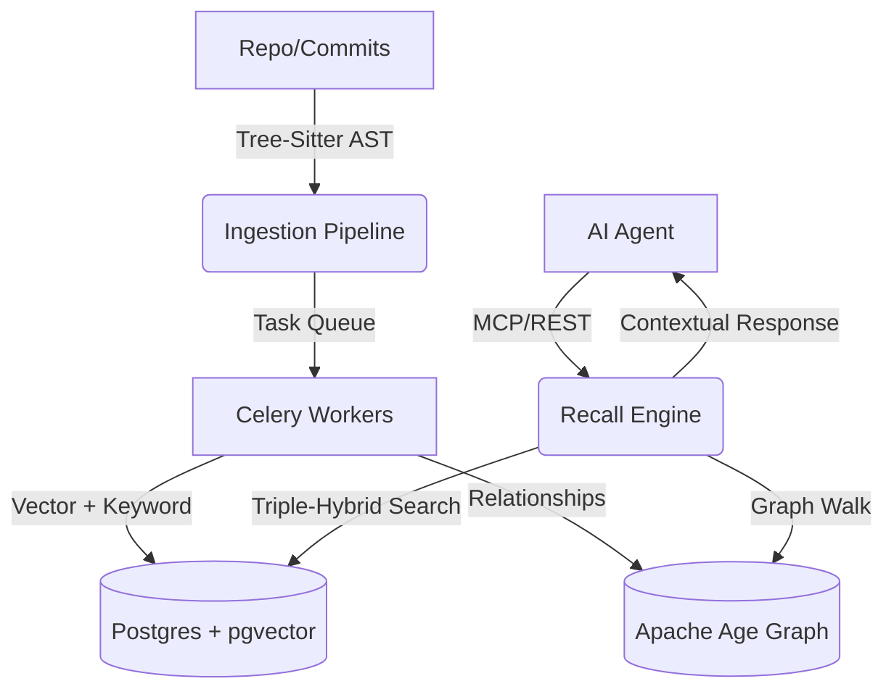

# 🌌 Universal AI Layer v4.0

[](https://github.com/NishantJLU/Universal-AI-Memory-Layer/releases/tag/v4.0.0)
[](https://opensource.org/licenses/MIT)
[](https://www.python.org/downloads/)
[](https://fastapi.tiangolo.com/)
[](https://reactjs.org/)
[](https://www.postgresql.org/)

**Universal AI Layer** is an autonomous intelligence memory platform designed for high-performance engineering teams. It provides AI agents with deep, long-term context about complex software ecosystems by unifying semantic depth, keyword precision, and architectural relationships.

---

## 🚀 The Triple-Hybrid Engine
Unlike traditional vector databases, v4.0 introduces the **Triple-Hybrid Search** strategy, ensuring that AI agents never lose the "forest for the trees."

1.  **Semantic Depth:** Leverages `pgvector` for high-dimensional embedding similarity.
2.  **Keyword Precision:** Utilizes PostgreSQL `tsvector` for exact match and BM25-grade keyword recall.
3.  **Graph Context:** Powered by **Apache Age**, mapping complex code dependencies and architectural relationships into a queryable knowledge graph.

---

## ✨ Key v4.0 Features

- **🧠 Deep Code Intelligence:** AST-aware ingestion via `tree-sitter`. Automatically builds **Call Graphs** and structural hierarchies (`File -> Class -> Function`).
- **🔍 Impact Analysis Engine:** New recursive graph-walking engine that identifies cascading dependencies and architectural risks when core code is modified.
- **⚙️ Autonomous Scalability:** Distributed background processing with **Celery + Redis** for massive codebase ingestion.
- **🔦 Explainable AI (XAI):** Transparent score breakdowns and source citations for every recalled memory.
- **🛡️ Proactive Watchdogs:** Real-time Slack/Discord alerts for architectural deviations or conflicting decisions.
- **🏢 Enterprise Ready:** Multi-tenancy with **PostgreSQL Row-Level Security (RLS)**, **OpenTelemetry** tracing, and high-speed **Semantic Caching**.
- **🔒 Hybrid Privacy:** Toggle between OpenAI for speed and **Ollama** for air-gapped, local-first security.
- **📊 Visual Dashboard:** Interactive React UI featuring a **Memory Constellation** visualization and conflict resolution suite.

---

## 🛠️ Tech Stack

| Layer | Technology |
|---|---|
| **Backend** | FastAPI (Python 3.13), SQLAlchemy (Async) |
| **Database** | PostgreSQL, `pgvector`, Apache Age (Graph) |
| **Task Queue** | Celery, Redis |
| **Observability** | OpenTelemetry, Prometheus/Grafana |
| **Frontend** | React, Vite, Tailwind CSS, `react-force-graph` |
| **Ingestion** | `tree-sitter`, GitPython |

---

## 🏗️ Architecture


---

## 🏁 Quick Start

### 1. Clone & Prepare
```bash
git clone https://github.com/NishantJLU/Universal-AI-Memory-Layer.git
cd Universal-AI-Memory-Layer
cp .env.example .env   # Configure your API keys and providers
```

### 2. Launch Infrastructure
Spin up the database, Redis, and Graph extensions:
```bash
docker-compose up -d
```

### 3. Initialize Backend
```bash
python -m venv venv
source venv/bin/activate  # Windows: venv\Scripts\activate
pip install -r requirements.txt
python src/main.py
```

### 4. Launch Visual Dashboard
```bash
cd dashboard
npm install
npm run dev
```

---

## 📂 Project Structure
```text
├── src/           # FastAPI Backend (Recall, Ingest, Providers)
├── dashboard/     # React + Vite Frontend (Visualization, Management)
├── tests/         # Comprehensive Async Test Suite
├── Dockerfile     # Optimized multi-stage build
├── requirements.txt
└── .env.example
```

---

## 🤝 Contributing
We welcome contributions that push the boundaries of AI memory. Please see our [Contributing Guide](CONTRIBUTING.md) for more details.

## 📄 License
MIT License — Created by **NishantJLU**
